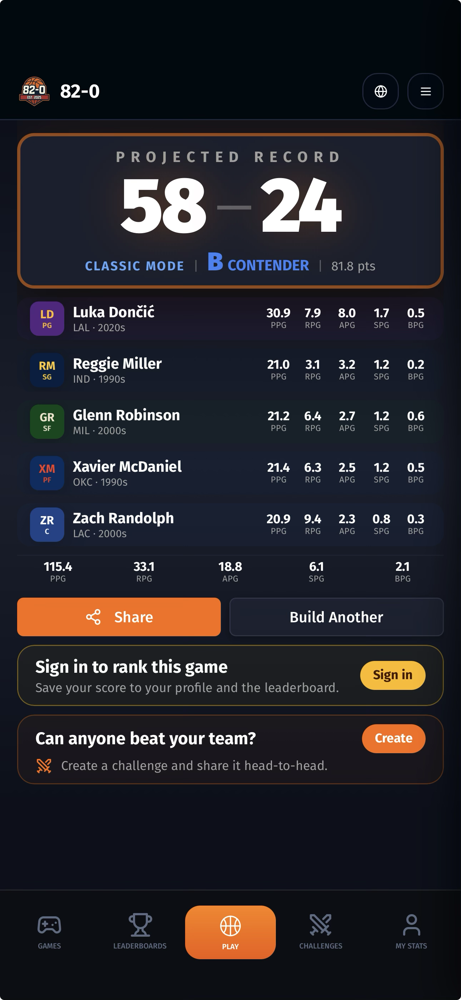
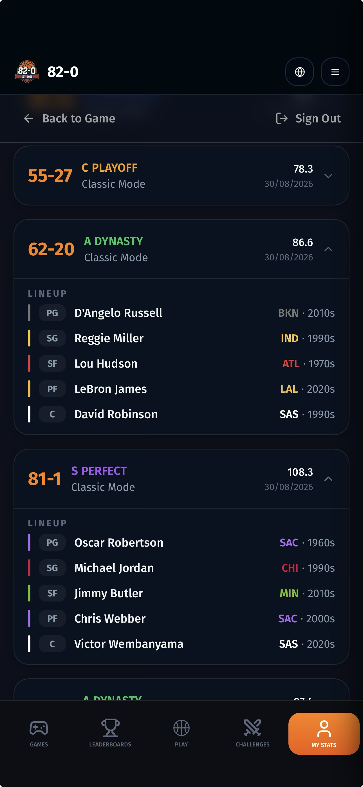
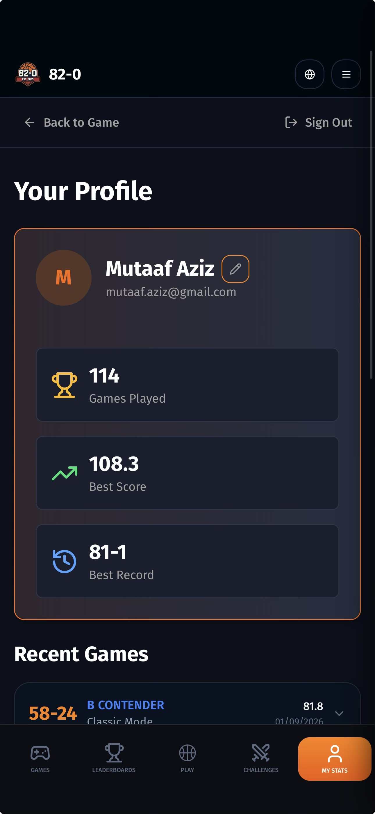
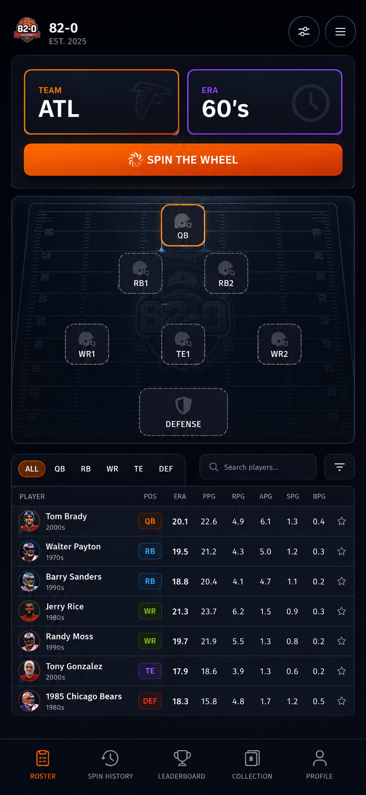
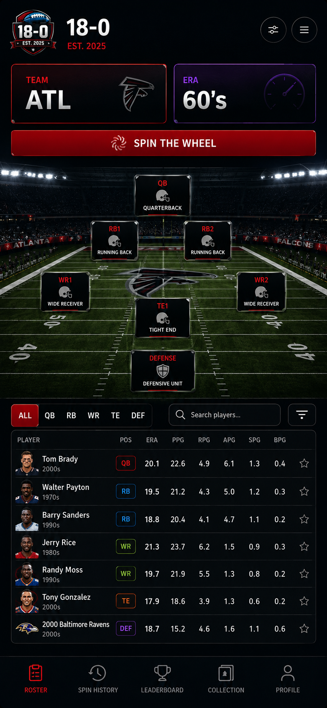

# 18-0 — PRFAQ + End-to-End React Native Build Specification

**Document type:** Product Requirements + FAQ + Technical Build Spec  
**Audience:** Coding agent / product engineer / designer  
**Primary client:** React Native (iOS + Android)  
**Working title:** **18-0**  
**Core promise:** **Spin history. Build seven. Chase perfection.**

---

## 1. Executive Summary

18-0 is a fast, replayable NFL historical roster-building game.

The user repeatedly spins a wheel that returns a **Team + Era** combination. From the eligible historical players for that franchise/era, the user selects one player and assigns him to an open roster slot:

- QB
- RB1
- RB2
- WR1
- WR2
- TE1
- Defense

When all seven slots are filled, the app computes a deterministic **18-0 Rating** and maps it to an 18-game projected record from **0-18 through 18-0**.

The game is intentionally simple on the surface:

> **SPIN → PICK → FILL → RATE → SHARE → REPLAY**

The depth lives in the historical player-rating model, era normalization, roster weighting, weak-link penalties, perfection gates, saved game history, challenges, leaderboards, and profile progression.

There is **no possession simulation and no random win/loss simulation after roster completion**. The same roster should always receive the same score and record for a given scoring-model version.

---

# 2. Visual Direction

## Existing Basketball Product Reference

The existing product establishes the visual language and interaction patterns that should be retained where useful.

### Existing result screen



### Existing game history screen



### Existing profile screen



## NFL Direction

The NFL version should preserve the dark, premium, game-like presentation while moving away from basketball conventions.

### NFL roster concept



### NFL broadcast-field direction



### Design principles

1. **Broadcast, not fantasy spreadsheet.**
2. Use a dark stadium / broadcast visual language.
3. The field should feel like a TV pregame lineup graphic.
4. Position cards should feel collectible and high-value.
5. The final rating reveal must feel like the emotional payoff.
6. 17-1 should feel painful.
7. 18-0 should feel legendary.
8. Keep the main loop understandable within seconds.
9. Avoid cluttering the primary flow with deep analytics.
10. Advanced methodology belongs behind details screens.

---

# 3. Press Release

## Introducing 18-0: The NFL History Roster Game Where Perfection Is Almost Impossible

Today we are introducing **18-0**, a historical NFL roster-building game built around one question:

> **Can you build the perfect team from the spins you are given?**

Each spin gives the player a random **NFL franchise and era**. The player then chooses one eligible historical player from that combination and places him into one of seven roster positions: quarterback, two running backs, two wide receivers, tight end, or defense.

Once the lineup is complete, 18-0 evaluates each selection using a historically normalized rating model that compares players with their position and era. The final roster earns an **18-0 Rating** and a projected 18-game record.

A good roster might finish 12-6. An incredible roster might reach 16-2. A nearly flawless build could finish 17-1.

Only a truly extraordinary roster can achieve:

# 18-0

There are no random season simulations after the draft. Your final record comes directly from the roster you built.

The same roster gets the same result.

That means every choice matters.

Players can save their best teams, compare historical builds, challenge friends, climb leaderboards, share final result cards, and keep spinning in pursuit of the one record that matters.

**18-0: Spin history. Build seven. Chase perfection.**

---

# 4. Customer Problem

Sports fans love debating historical greatness, but most historical-player products become one of two things:

- complicated simulation engines, or
- shallow “pick the biggest name” games.

18-0 should live between them.

The player should not need to understand EPA, ANY/A, era normalization, or weighting formulas to enjoy the game.

The user experience should remain:

> “I spun Minnesota + 1990s. Do I take Randy Moss now, or save WR for another spin?”

The deeper scoring system should make that choice meaningful without forcing the user to study the scoring model.

---

# 5. Target Experience

A complete normal game should take approximately **2–5 minutes**.

The user should be able to:

1. Open the app.
2. Tap **Play**.
3. Spin.
4. See Team + Era.
5. Browse eligible players.
6. Select a player.
7. Assign the player to an eligible empty roster slot.
8. Repeat until seven selections are complete.
9. View the final reveal.
10. Save/share/challenge/replay.

The experience must be fully usable without signing in.

Authentication is required only for persistent cross-device profile features, global leaderboard identity, and account-specific history.

---

# 6. Core Gameplay Rules

## 6.1 Roster

Exactly seven selections:

| Slot | Accepted Player Type |
|---|---|
| QB | QB |
| RB1 | RB |
| RB2 | RB |
| WR1 | WR |
| WR2 | WR |
| TE1 | TE |
| Defense | Team defensive season |

No FLEX in V1.

No kicker.

No individual defensive players.

No offensive line slots.

---

## 6.2 Spin

Each spin returns:

- `franchise`
- `era`

Recommended eras:

- 1950s
- 1960s
- 1970s
- 1980s
- 1990s
- 2000s
- 2010s
- 2020s

Only valid franchise-era combinations may exist in the wheel pool.

Example:

- Jacksonville + 1970s must never occur.
- Carolina + 1960s must never occur.

The wheel should be driven by a server-defined valid-combination dataset rather than hard-coded UI logic.

---

## 6.3 Eligible Players

After a spin, show all qualifying players for that franchise + era.

Each player card should include:

- player name
- position
- franchise
- peak qualifying season
- overall player rating
- 2–4 quick stats
- era label
- eligibility
- optional detail button

Search and position filtering should be available.

If no eligible players remain for any open roster slot, allow the user to re-spin rather than dead-ending the game.

---

# 7. Player Season Selection

The user chooses a player, not a year.

The game automatically uses that player’s **highest-rated qualifying season for the spun franchise during the spun era**.

Example:

**Spin:** SF + 1980s  
**Selection:** Jerry Rice  
**Card used:** highest-rated qualifying Jerry Rice season for San Francisco from 1980–1989.

Persist the exact underlying season ID with the game result.

---

# 8. Player Rating Philosophy

The rating answers:

> **How dominant was this player’s season relative to what was possible at his position and in his era?**

It does not answer:

> “Who accumulated the largest raw stat total?”

All primary components should be normalized against the same-position league environment for that season.

Use a versioned scoring model.

---

# 9. Player Rating Scale

| Rating | Meaning |
|---:|---|
| 99.5–100 | GOAT-level season |
| 98–99.4 | Historically dominant |
| 96–97.9 | All-time elite |
| 93–95.9 | First-Team All-Pro caliber |
| 90–92.9 | Elite NFL season |
| 86–89.9 | Pro Bowl caliber |
| 82–85.9 | Very good starter |
| 77–81.9 | Good starter |
| 72–76.9 | Average starter |
| 65–71.9 | Below-average starter |
| <65 | Weak selection |

Ratings must be calibrated so that 99+ remains extremely rare.

---

# 10. Era Normalization

For each supported metric:

```text
z_score = (player_metric - positional_season_mean) / positional_season_stddev
```

Transform the z-score into a bounded component score.

Recommended conceptual interpretation:

- 0 SD = average
- +1 SD = excellent
- +2 SD = elite
- +3 SD = historically dominant
- +4 SD = extreme historical outlier

The transformation should be smooth and capped.

Advanced metrics that are not available historically must use documented fallback metrics.

Never silently treat missing advanced data as zero.

---

# 11. Position Rating Models

## QB

| Component | Weight |
|---|---:|
| Era-adjusted passing efficiency | 30% |
| TD / scoring production | 15% |
| Turnover avoidance | 15% |
| Passing volume/value | 10% |
| Rushing value | 5% |
| Sack avoidance / pressure value | 5% |
| Peak dominance vs league | 10% |
| Awards / honors | 5% |
| Team offensive success | 5% |

Historical fallback hierarchy:

1. EPA/play
2. ANY/A
3. adjusted net passing metrics
4. era-relative yards/attempt + TD% + INT%

---

## RB

| Component | Weight |
|---|---:|
| Era-adjusted rushing efficiency | 25% |
| Rushing production | 20% |
| Receiving value | 15% |
| TD/scoring value | 10% |
| First-down/success value | 10% |
| Explosive plays | 5% |
| Ball security | 5% |
| Peak dominance | 5% |
| Awards | 5% |

---

## WR

| Component | Weight |
|---|---:|
| Era-adjusted receiving production | 25% |
| Receiving efficiency | 20% |
| TD production | 15% |
| First-down/value creation | 10% |
| Share of team offense | 10% |
| Explosive plays | 5% |
| Catch efficiency | 5% |
| Peak dominance | 5% |
| Awards | 5% |

WR1 and WR2 use the same player rating.

Their roster impact differs only by roster weight.

---

## TE

| Component | Weight |
|---|---:|
| Receiving efficiency | 20% |
| Receiving production | 20% |
| TD production | 10% |
| Positional dominance | 20% |
| First-down/success value | 10% |
| Blocking contribution | 10% |
| Peak dominance | 5% |
| Awards | 5% |

Tight ends should primarily be evaluated relative to other tight ends.

---

## Defense

Defense is a full team defensive season.

| Component | Weight |
|---|---:|
| Points allowed / drive | 20% |
| Defensive EPA/play | 20% |
| Passing defense | 12% |
| Rushing defense | 10% |
| Turnovers forced | 10% |
| Sack / pressure production | 8% |
| Red-zone defense | 5% |
| Third-down defense | 5% |
| Era dominance | 5% |
| Historical / award adjustment | 5% |

Historical fallback hierarchy:

1. defensive EPA/play
2. points/drive
3. points/game relative to league
4. yards/play relative to league
5. turnovers/sacks relative to league

---

# 12. Qualification Floors

To avoid small-sample exploits:

| Position | Minimum |
|---|---|
| QB | 8 starts |
| RB | 100 touches |
| WR | 40 targets |
| TE | 30 targets |
| Defense | full team season |

Shortened historical seasons should use proportional qualification.

---

# 13. Roster Weighting

Base roster rating:

```text
QB   = 24%
DEF  = 18%
WR1  = 13%
RB1  = 12%
WR2  = 11%
TE1  = 11%
RB2  = 11%
```

Total = 100%.

```text
base_rating =
  qb_rating  * 0.24 +
  def_rating * 0.18 +
  wr1_rating * 0.13 +
  rb1_rating * 0.12 +
  wr2_rating * 0.11 +
  te_rating  * 0.11 +
  rb2_rating * 0.11
```

---

# 14. Weak-Link Penalty

A perfect roster requires excellence everywhere.

Any slot below 90 contributes a penalty.

Recommended initial model:

```text
slot_penalty =
  max(0, 90 - player_rating) ^ 1.35
  * position_penalty_factor
  * penalty_scale
```

Position penalty factors:

```text
QB  = 1.20
DEF = 1.10
WR1 = 1.00
RB1 = 1.00
WR2 = 0.95
TE1 = 0.95
RB2 = 0.95
```

`penalty_scale` must be calibrated empirically using roster-combination simulations.

The purpose is not to punish ordinary rosters excessively.

The purpose is to prevent six elite selections from completely hiding one weak slot.

---

# 15. Elite Depth Bonus

Reward truly stacked lineups.

Suggested starting rules:

```text
3+ players >= 95 : +0.25
5+ players >= 95 : +0.50
7 players  >= 95 : +0.75

3+ players >= 98 : +0.25
5+ players >= 98 : +0.40
```

Total elite bonus capped at:

```text
+1.25
```

---

# 16. Chemistry

Chemistry is intentionally small.

Maximum range:

```text
-1.0 to +1.0
```

Possible dimensions:

- deep passer + vertical receiver
- receiving RB + precision passing offense
- complementary RB archetypes
- TE usage fit
- offensive versatility

Historical teammates do not receive an automatic bonus merely for having played together.

Chemistry must never rescue a materially weak roster.

---

# 17. Final 18-0 Rating Formula

```text
raw_team_rating =
  base_rating
  - weak_link_penalty
  + elite_depth_bonus
  + chemistry_bonus
```

Then transform/calibrate the raw score against the expected population of plausible roster combinations.

```text
final_rating = calibrated(raw_team_rating)
```

Clamp:

```text
0 <= final_rating <= 100
```

The score must be deterministic.

Store:

```text
rating_model_version
```

with every completed game.

---

# 18. Rating Distribution Targets

Initial calibration target across large volumes of synthetically generated valid rosters:

| Percentile | Approx Final Rating |
|---:|---:|
| 50th | 80 |
| 75th | 87 |
| 90th | 92 |
| 95th | 95 |
| 99th | 97.5 |
| 99.9th | 99 |
| extreme tail | 99.25+ |

Goal:

**18-0 should be genuinely rare.**

Do not ship a scoring curve where routine elite rosters score 99+.

---

# 19. Complete Season Ending Taxonomy

Every possible 18-game record has a named ending.

| Record | Finish | Tier |
|---|---|---|
| 0-18 | Historic Collapse | F |
| 1-17 | Rock Bottom | F |
| 2-16 | Rebuild | F |
| 3-15 | Lost Season | D |
| 4-14 | Bottom Feeder | D |
| 5-13 | Struggling | D |
| 6-12 | Underachiever | C- |
| 7-11 | Fringe | C |
| 8-10 | Almost There | C+ |
| 9-9 | Average | B- |
| 10-8 | Winning Season | B |
| 11-7 | Wild Card | B+ |
| 12-6 | Playoff Team | A- |
| 13-5 | Contender | A |
| 14-4 | Elite | A |
| 15-3 | Championship Caliber | A+ |
| 16-2 | Dynasty | S |
| 17-1 | Heartbreak | S+ |
| 18-0 | PERFECT | IMMORTAL |

---

# 20. Score-to-Record Mapping

Use deterministic thresholds.

Initial proposal:

| Rating | Record |
|---:|---|
| <61 | 0-18 |
| 61–62.9 | 1-17 |
| 63–64.9 | 2-16 |
| 65–66.9 | 3-15 |
| 67–68.9 | 4-14 |
| 69–70.9 | 5-13 |
| 71–72.9 | 6-12 |
| 73–74.9 | 7-11 |
| 75–76.9 | 8-10 |
| 77–79.9 | 9-9 |
| 80–82.49 | 10-8 |
| 82.5–84.99 | 11-7 |
| 85–87.49 | 12-6 |
| 87.5–89.99 | 13-5 |
| 90–92.49 | 14-4 |
| 92.5–94.49 | 15-3 |
| 94.5–96.49 | 16-2 |
| 96.5–99.249 | 17-1 |
| 99.25+ | eligible for 18-0 |

These thresholds are configuration, not code constants.

---

# 21. 18-0 Perfection Gates

A score >= 99.25 is necessary but not sufficient.

To receive 18-0:

```text
final_rating >= 99.25
QB >= 98
Defense >= 98
Every roster slot >= 96
At least 4 roster positions >= 98
```

If the rating reaches 99.25 but one or more perfection gates fail:

```text
record = 17-1
```

The result screen should explain the blocker.

Example:

> **PERFECTION DENIED**  
> RB2 needed a 96.0 minimum for 18-0 eligibility.

This makes 18-0 difficult without hidden randomness.

---

# 22. Core Screens

## 22.1 Home / Play

Purpose:

Start or resume a game.

Primary actions:

- Play
- Resume Game if one exists
- View Leaderboard
- View My Stats
- Optional challenge entry

---

## 22.2 Spin + Roster Builder

The primary gameplay screen.

Top:

- 18-0 brand
- current Team
- current Era
- Spin button

Center:

NFL broadcast-style field.

Formation:

```text
               QB

        RB1          RB2

WR1          TE1          WR2

             DEF
```

Filled player cards should display:

- surname
- season
- overall rating
- small franchise marker

Empty slots clearly show position name.

Below or as a sheet:

- eligible player list
- position filters
- search
- sorting
- player details

Primary action after selection:

**ADD TO ROSTER**

---

## 22.3 Player Detail

Show:

- name
- franchise
- selected historical season
- rating
- component ratings
- raw key statistics
- league-relative metrics
- awards
- brief explanation of rating

Do not require this screen to complete gameplay.

---

## 22.4 Final Reveal

This is the payoff screen.

Required content:

- projected record
- ending name
- tier
- final 18-0 Rating
- all seven selected roster members
- individual ratings
- team offense rating
- defense rating
- chemistry grade/bonus
- weak-link impact if any
- distance from 18-0
- perfection-gate explanation if 17-1 at >=99.25
- Share
- Build Another
- Save / Sign In CTA when anonymous
- Challenge CTA

Visual state should change based on result tier.

Special states:

### 17-1
Use language such as:

> **HEARTBREAK**  
> One loss from immortality.

### 18-0
Full premium celebration:

> **PERFECT**  
> **18-0**  
> **IMMORTAL**

Use restrained but unmistakable animation, haptics, lighting treatment, and share-card presentation.

Respect Reduce Motion.

---

## 22.5 History / My Games

Each game row:

- record
- finish
- tier
- final rating
- date
- mode
- expand/collapse

Expanded state:

- all seven roster selections
- team + era used for each selection
- season
- rating

Allow:

- share
- view full result
- challenge from roster
- delete only if product wants user-controlled history cleanup

---

## 22.6 Profile / My Stats

Required stats:

- Games Played
- Best Rating
- Best Record
- Number of 18-0 finishes
- Number of 17-1 finishes
- Average Rating
- Most-used franchise
- Most-used era
- highest-rated player ever drafted
- recent games

Possible future stats:

- percentile rank
- current streak
- longest 90+ streak
- perfect-position counts
- favorite position
- collection completion

---

## 22.7 Leaderboards

Initial leaderboards:

- Highest Rating
- Most 18-0 Seasons
- Most 17-1+ Seasons
- Best Average Rating with minimum game count

Filters:

- All Time
- This Month
- This Week

Tie-breakers:

1. rating
2. fewer games to achieve
3. earlier timestamp

Prevent duplicate exact-roster spam from dominating leaderboard placement.

---

## 22.8 Challenges

A completed roster can create a challenge.

Challenge contains:

- challenge ID
- creator
- creator rating
- creator record
- creator roster
- optional share token

Opponent plays a fresh normal game.

At completion compare:

1. final rating
2. if tied, higher lowest-position rating
3. if tied, higher QB rating
4. if tied, draw

Do not alter the core rating formula for challenges.

---

# 23. Navigation

Recommended bottom navigation:

- **Games**
- **Leaderboards**
- **Play**
- **Challenges**
- **My Stats**

Center Play action should remain visually dominant.

---

# 24. Authentication

Anonymous users can:

- play
- finish games
- maintain local history
- share result images

Authenticated users can:

- sync history
- appear on leaderboards
- create persistent challenges
- maintain cross-device profile
- restore purchases/settings if future monetization exists

Recommended authentication:

- Sign in with Apple
- Google
- email magic link if desired

Do not block first-play behind registration.

---

# 25. Recommended Technical Stack

## Mobile

- React Native
- TypeScript
- Expo
- Expo Router
- React Native Reanimated
- Expo Haptics
- Zustand for local gameplay/session state
- TanStack Query for remote server state
- React Hook Form + Zod for forms/validation where applicable

Avoid unnecessary state-management complexity.

Gameplay session state should be serializable.

---

# 26. Backend

Recommended production path:

**Supabase**

Use:

- PostgreSQL
- Auth
- Row Level Security
- Edge Functions for secure scoring and leaderboard writes
- Storage if needed for generated share assets

The server should be authoritative for:

- player ratings
- rating-model version
- final roster score
- record mapping
- perfection gates
- leaderboard writes

The client can calculate a preview score, but completion should be confirmed by the server.

This prevents modified clients from posting fake 18-0 results.

---

# 27. Data Model

## franchises

```sql
id
slug
display_name
abbreviation
city
active_from
active_to
lineage_id
primary_color
secondary_color
logo_asset_key
```

## eras

```sql
id
label
start_year
end_year
sort_order
```

## franchise_eras

```sql
id
franchise_id
era_id
is_valid
spin_weight
```

## players

```sql
id
display_name
primary_position
normalized_position
external_ids jsonb
```

## player_seasons

```sql
id
player_id
franchise_id
season_year
games
starts
raw_stats jsonb
advanced_stats jsonb
awards jsonb
qualified boolean
```

## player_season_ratings

```sql
id
player_season_id
rating_model_version
overall_rating numeric
component_scores jsonb
era_adjustments jsonb
explanation jsonb
```

## defense_seasons

```sql
id
franchise_id
season_year
raw_stats jsonb
advanced_stats jsonb
overall_rating numeric
component_scores jsonb
rating_model_version
```

## game_sessions

```sql
id
user_id nullable
status
created_at
completed_at
rating_model_version
final_rating
record_wins
record_losses
ending_key
tier
chemistry_bonus
weak_link_penalty
elite_bonus
```

## game_spins

```sql
id
game_session_id
sequence
franchise_id
era_id
created_at
```

## game_selections

```sql
id
game_session_id
spin_id
roster_slot
entity_type
player_season_rating_id nullable
defense_season_id nullable
display_rating
```

## challenges

```sql
id
creator_user_id
creator_game_session_id
share_token
status
opponent_user_id nullable
opponent_game_session_id nullable
created_at
completed_at
```

---

# 28. API / Service Contract

Suggested endpoints or RPC equivalents.

## Game

```text
POST /games
GET  /games/:id
POST /games/:id/spin
GET  /games/:id/spin/:spinId/eligible-players
POST /games/:id/select
DELETE /games/:id/select/:slot
POST /games/:id/complete
```

## History

```text
GET /me/games
GET /me/stats
```

## Leaderboard

```text
GET /leaderboards?period=all_time&type=rating
```

## Challenge

```text
POST /challenges
GET /challenges/:token
POST /challenges/:token/join
```

Server completion response should return:

```json
{
  "finalRating": 98.7,
  "record": {
    "wins": 17,
    "losses": 1
  },
  "ending": {
    "key": "HEARTBREAK",
    "label": "Heartbreak",
    "tier": "S+"
  },
  "breakdown": {
    "baseRating": 98.2,
    "weakLinkPenalty": 0.15,
    "eliteBonus": 0.45,
    "chemistryBonus": 0.2
  },
  "perfectEligibility": {
    "eligible": false,
    "failedGates": [
      {
        "slot": "RB2",
        "required": 96,
        "actual": 95.4
      }
    ]
  },
  "ratingModelVersion": "1.0.0"
}
```

---

# 29. State Machine

Gameplay should explicitly follow a state machine.

```text
NEW
  ↓
READY_TO_SPIN
  ↓
SPIN_REVEALED
  ↓
PLAYER_BROWSING
  ↓
PLAYER_SELECTED
  ↓
ROSTER_UPDATED
  ↓
READY_TO_SPIN
```

After seventh selection:

```text
ROSTER_COMPLETE
  ↓
CALCULATING
  ↓
RESULT_REVEALED
  ↓
SAVED
```

Support:

- app termination
- resume
- network loss
- auth changes
- duplicate taps
- stale spin responses

Persist incomplete games locally.

---

# 30. Error Handling

The app must gracefully handle:

- no network
- slow spin
- eligible list failure
- invalid roster slot
- duplicate player selection
- server/client rating-model mismatch
- game already completed
- expired challenge
- unavailable user account
- partial history fetch
- missing player imagery
- absent advanced stats

Never leave the user on a blank screen.

Every async action needs:

- loading state
- success state
- recoverable error state
- retry where appropriate

---

# 31. Offline Behavior

Minimum offline support:

- app shell loads
- cached historical data can be browsed
- active local game survives restart
- previous local games remain viewable

A new official game should require server connectivity unless the complete eligible dataset + scoring model is bundled and tamper-resistance is not a concern.

For production leaderboards, completion must eventually be server-verified.

---

# 32. Share Experience

Generate a native share card.

Required share-card content:

```text
18-0 logo
Final record
Ending / tier
18-0 Rating
Seven-position roster
Player ratings
CTA: Can you beat this roster?
Challenge link when available
```

Special 18-0 share card should be visually distinct.

Use native share sheet.

---

# 33. Analytics Events

At minimum:

```text
app_opened
play_started
game_resumed
spin_started
spin_completed
eligible_player_viewed
player_details_opened
player_selected
roster_slot_filled
selection_removed
roster_completed
result_revealed
result_shared
build_another_tapped
sign_in_prompted
sign_in_completed
challenge_created
challenge_joined
leaderboard_viewed
profile_viewed
```

Properties should include non-sensitive gameplay metadata:

```text
game_id
spin_sequence
franchise_id
era_id
position
player_rating_bucket
final_rating_bucket
record
ending_key
rating_model_version
```

---

# 34. Accessibility

Required:

- VoiceOver/TalkBack labels
- logical focus order
- minimum touch targets
- dynamic text support
- sufficient contrast
- do not communicate result tier by color alone
- Reduce Motion support
- vibration/haptics must not be the only signal
- player/position cards must expose accessible names

Example:

> “Quarterback slot. Tom Brady. 2007 New England. Rating 99.4. Selected.”

---

# 35. Performance Requirements

Targets:

- app becomes interactable quickly on modern iPhone/Android devices
- spin animation remains 60 FPS where supported
- player list supports hundreds of rows without frame drops
- use FlashList or another performant virtualized list if needed
- image loading must be cached
- no giant raw historical dataset parsing on every render
- scoring preview must feel instantaneous
- result reveal must begin immediately after server response

---

# 36. Security / Integrity

Do not trust:

- client-computed rating
- client-supplied player rating
- client-supplied final record
- client-supplied leaderboard value

Server receives roster selection IDs and recomputes/looks up the authoritative result.

Use:

- RLS
- authenticated leaderboard writes
- idempotency for completion
- rate limits for spins/challenges if abuse emerges
- signed/versioned scoring rules where appropriate

---

# 37. Testing Strategy

## Unit Tests

Must cover:

- valid franchise-era generation
- player eligibility
- position assignment
- rating weighting
- weak-link penalty
- elite bonus
- chemistry
- score calibration
- score-to-record mapping
- every one of the 19 record endings
- all 18-0 perfection gates
- exact boundary values

Examples:

```text
96.499 -> 16-2
96.500 -> 17-1
99.249 -> 17-1
99.250 + all gates pass -> 18-0
99.250 + one gate fails -> 17-1
```

## Integration Tests

Cover:

- create game → spin → list players → select → complete
- anonymous user
- signed-in user
- app restart mid-game
- duplicate completion request
- stale scoring version
- challenge flow
- leaderboard submission

## E2E

Use Maestro or Detox.

Critical paths:

1. first-time user completes game
2. returning user resumes game
3. 17-1 perfection denied
4. valid 18-0 result
5. share
6. sign-in after result
7. view saved game in My Stats
8. create challenge

---

# 38. Seed / Fixture Games

The coding agent must include deterministic fixtures for visual and E2E testing.

## Weak roster

```text
Expected ending: 6-12 / Underachiever
```

## Average roster

```text
Expected ending: 9-9 / Average
```

## Playoff roster

```text
Expected ending: 12-6 / Playoff Team
```

## Elite roster

```text
Expected ending: 15-3 / Championship Caliber
```

## Dynasty roster

```text
Expected ending: 16-2 / Dynasty
```

## Heartbreak roster

```text
Expected rating: ~98.x
Expected ending: 17-1 / Heartbreak
```

## Perfection-gate failure

```text
Final rating >= 99.25
One required slot below gate
Expected ending: 17-1
Expected UI: PERFECTION DENIED
```

## Perfect roster

```text
Final rating >= 99.25
All perfection gates satisfied
Expected ending: 18-0 / PERFECT / IMMORTAL
```

---

# 39. Repository Structure

Suggested monorepo:

```text
18-0/
  apps/
    mobile/
      app/
      src/
        components/
        features/
          auth/
          game/
          spin/
          roster/
          results/
          history/
          profile/
          leaderboard/
          challenges/
        services/
        state/
        theme/
        utils/
        assets/
      e2e/
  packages/
    domain/
      scoring/
      game-rules/
      schemas/
      constants/
    api-client/
    ui/
  supabase/
    migrations/
    functions/
    seed/
  scripts/
    ingest/
    ratings/
    validation/
  docs/
    PRFAQ.md
    scoring-model.md
    data-sources.md
    architecture.md
```

Keep scoring logic in a pure shared domain package.

---

# 40. Coding-Agent Execution Plan

## Phase 1 — Foundation

- initialize Expo + TypeScript
- add Expo Router
- establish theme tokens
- implement bottom navigation
- create domain types
- create mock seed dataset
- create local game state machine

## Phase 2 — Core Gameplay

- spin UI
- team + era result
- eligible player browser
- position filtering/search
- roster assignment
- broadcast field
- local scoring implementation
- incomplete-game persistence

## Phase 3 — Result Loop

- final reveal
- all 19 season endings
- 17-1 special state
- 18-0 special state
- result breakdown
- Build Another
- history
- profile stats

## Phase 4 — Backend

- Supabase schema
- auth
- game persistence
- authoritative scoring
- history sync
- leaderboard

## Phase 5 — Social

- share cards
- challenges
- challenge deep links
- leaderboard filters

## Phase 6 — Production Hardening

- analytics
- crash reporting
- accessibility
- offline handling
- performance
- E2E
- app-store assets/configuration

---

# 41. Definition of Done — MVP

MVP is not complete until:

- user can start without auth
- user can spin valid Team + Era combinations
- user can browse eligible players
- user can assign all seven roster positions
- invalid assignments are prevented
- game survives app restart
- player ratings are versioned
- completed roster gets deterministic rating
- all records from 0-18 to 18-0 are supported
- ending name/tier is shown
- perfection gates work
- result screen shows roster + breakdown
- game is saved locally
- Build Another resets correctly
- history works
- profile best rating/best record works
- 17-1 and 18-0 have dedicated reveal states
- iOS and Android layouts work
- accessibility basics pass
- unit + E2E critical path tests pass

---

# 42. FAQ

## Why not simulate 18 games?

Because that makes the result feel random.

The product is about the roster the player built.

The final record should be an understandable consequence of roster quality.

---

## Why use an 18-game record if the NFL regular season format changes over time?

18-0 is the product metaphor and scoring scale.

It is not intended to recreate a literal historical schedule.

---

## Why make 18-0 so hard?

Because the product's entire identity depends on perfection carrying weight.

If players routinely reach 18-0, the chase stops being interesting.

---

## Why have perfection gates in addition to a numeric score?

A weighted average can hide one materially weak position.

The gates enforce the product promise:

> an 18-0 roster has no obvious weakness.

---

## Why is QB weighted highest?

The game should reflect positional importance while still requiring a complete roster.

A historically elite quarterback helps significantly, but cannot compensate for poor selections everywhere else.

---

## Why is Defense one slot?

It keeps the seven-selection loop fast and lets historically dominant defensive units become memorable cards without forcing the user to draft 11 defensive players.

---

## Why not make WR1 and WR2 different player ratings?

A player's historical season should have one understandable rating.

Roster-slot weights may differ, but the card itself should stay consistent.

---

## Should the user see the complete formula?

The user should see enough to trust the score:

- overall rating
- component scores
- era-relative explanation
- final roster breakdown

The exact calibration constants do not need to dominate the primary UI.

---

## Can a user get 18-0 more than once?

Yes.

The profile should track total 18-0 finishes and leaderboard achievements.

But the rarity target should make each one meaningful.

---

## Should a player be usable more than once in one roster?

No.

A unique historical player identity may only occupy one roster slot in a game.

Different seasons of the same player do not allow duplication.

---

## Can the same franchise/era spin happen more than once?

Yes, unless product testing shows it harms variety.

The spin itself is random; duplicate franchise-era results are valid.

---

## Should users be able to reroll?

Not in the default competitive mode.

Future modes can introduce rerolls, boosts, or daily challenges.

The standard mode should keep each spin meaningful.

---

# 43. Out of Scope for V1

Do not build these until the core loop is excellent:

- possession-by-possession game simulation
- injuries
- weather
- coaching staffs
- offensive line drafting
- IDP defense drafting
- kickers/punters
- salary caps
- card packs
- marketplace
- real-money mechanics
- fantasy-season management
- live NFL integration
- complex social feeds

---

# 44. Future Modes

Possible later extensions:

### Daily 18-0
Everyone gets the same sequence of spins.

### Era Lock
Build only from one decade.

### Franchise Lock
Build one franchise across history.

### Hard Mode
No search; limited player reveal.

### One Re-roll
One strategic re-spin per game.

### Head-to-Head
Both users receive the same spin sequence.

### Position Order
The game determines which roster slot must be filled next.

None of these should delay the core product.

---

# 45. Product Principles for the Coding Agent

When tradeoffs arise, prioritize in this order:

1. **Fast gameplay**
2. **Clear choices**
3. **Trustworthy rating**
4. **Meaningful 17-1 / 18-0 rarity**
5. **Strong final reveal**
6. **Replayability**
7. **Social sharing**
8. **Deep analytics**

Do not turn the app into a spreadsheet.

Do not turn it into a season simulator.

Do not hide whether a user can assign a selected player to a position.

Do not make the user register before playing.

Do not allow 18-0 to become common.

The core product should always feel like:

> **Spin. Choose. Build. Reveal. Again.**

---

# 46. Final Product Acceptance Statement

The app is successful when a new user can understand the game without a tutorial, complete a roster in a few minutes, immediately understand why their roster earned its record, feel genuine tension when approaching 17-1, recognize 18-0 as extremely rare, and instinctively want to tap:

# BUILD ANOTHER
