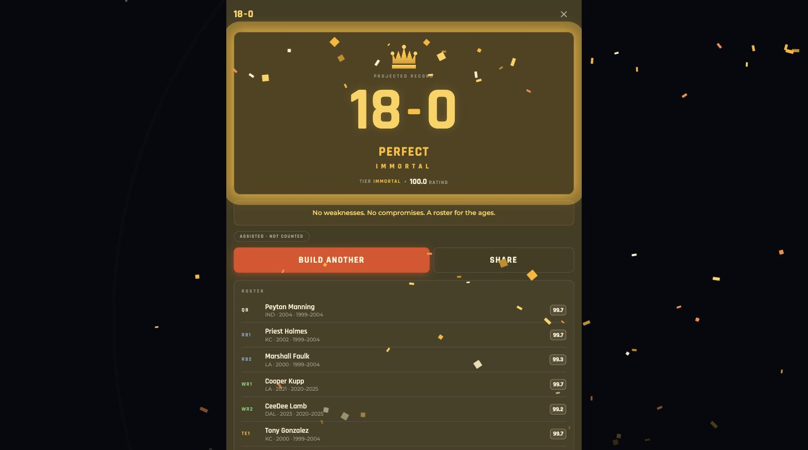
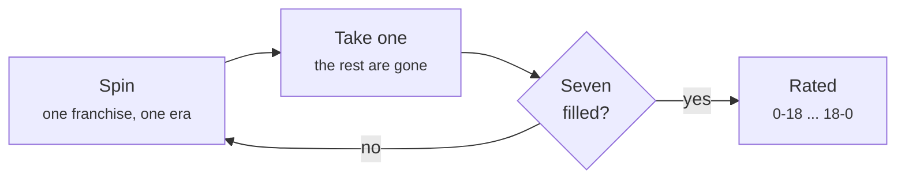
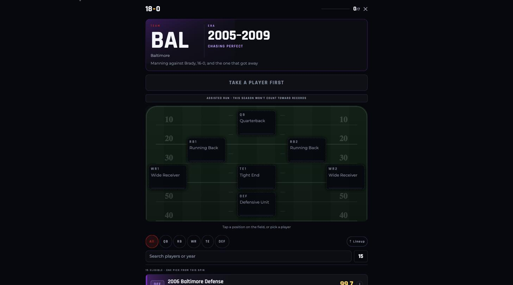
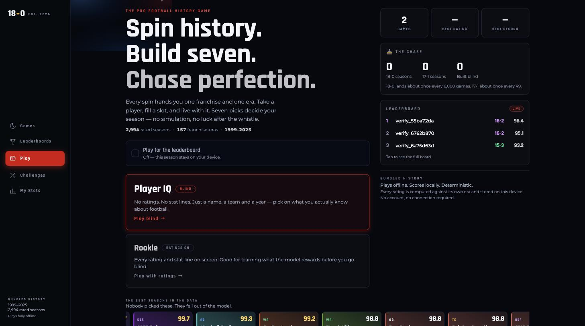

<div align="center">


**Spin history. Build seven. Chase perfection.**

A pro football history game. Spin for a franchise and an era, take one player,
fill seven slots, and receive a deterministic rating mapped to an 18-game
record — from 0-18 to 18-0.

No possession simulation. No random losses. The same roster always earns the
same record, so every choice is yours.

### [&#9654;&nbsp; Play it now, in your browser](https://18-0.co)

[](https://github.com/mutaaf/18-0/actions/workflows/ci.yml)
[](https://github.com/mutaaf/18-0/actions/workflows/pages.yml)
[](LICENSE)


<br>



<sub><b>18-0.</b> It lands about once every 6,000 games.</sub>

</div>

---

## The loop

> **Spin** a franchise and an era &rarr; **take one player** &rarr; **fill seven slots** &rarr;
> **reveal** your season.



Seven positions: a quarterback, two running backs, two receivers, a tight end,
and a team defense. Each spin gives you **exactly one pick**, and there are no
takebacks. The whole game lives in one question — *do I take this receiver now,
or hold out for the tight end I still need?*

<div align="center">

</div>

---

## The ratings are real, and they argue for themselves

Every card is a real season, rated against **its own era**. The model asks *how
dominant was this season relative to what was possible at this position in this
year* — not *who piled up the biggest totals* — so a 1999 receiver and a 2024
receiver are directly comparable.

Here is the model's own verdict on the best seasons in the data:

| Position | Top-rated season | |
|---|---|---|
| **QB** | Peyton Manning · Indianapolis 2004 | `99.7` |
| **RB** | Priest Holmes · Kansas City 2002 | `99.7` |
| **WR** | Cooper Kupp · Los Angeles 2021 | `99.7` |
| **TE** | Todd Christensen · Las Vegas 1983 | `99.7` |
| **DEF** | Baltimore 2006 | `99.7` |

Franchises are named for the city they play in now, because a lineage is one
continuous history here and a club name is a trademark — so a pre-relocation
season carries the franchise's current city rather than the one it played in
that year.

**Nobody picked those. They fell out of the model.** That is the entire
credibility argument, and it makes itself in public on the first screen of the
app — if the ratings were wrong, this is where anyone who watches football would
see it.

**4,872 rated seasons · 218 franchise-era combinations · 1980–2025**, built from
[nflverse](https://nflverse.com).

<details>
<summary><b>How a season becomes a number</b></summary>

<br>

Each metric is z-scored against the same-position league environment for that
exact era, then combined through position weight tables, then mapped through a
monotonic calibration curve fitted on 250,000 simulated games.

Three properties the model holds onto:

- **Production is never punished.** A receiver with more yards *and* more
  receptions can never rate below one with less of both. Getting this wrong is
  what per-opportunity rates do, and it took three passes to fix — shrunk rates,
  then value-above-expectation, then weighting production above efficiency.
- **Positions are not siloed.** Running backs catch passes and receivers run the
  ball, and both count.
- **Unmeasurable means removed.** Seven components could not be populated from
  the available data — awards, tight-end blocking, red-zone and third-down
  defense among them. They were deleted rather than left in the model silently
  scoring zero, so the published weight tables are the ones that actually run.

[`docs/scoring-model.md`](docs/scoring-model.md) has the full method.
[`docs/FINDINGS.md`](docs/FINDINGS.md) records what the simulation harness
found, including the fact that the perfection gates *as originally specified*
produced **zero** 18-0 seasons in 600,000 games.

</details>

---

## Perfection is gated, not lucky

A high score is necessary and not sufficient. To finish 18-0 a roster must have
no weakness anywhere:

| Gate | Requirement |
|---|---|
| Score | ≥ 99 |
| Every slot | ≥ 94 — First-Team All-Pro caliber |
| QB and defense | ≥ 96 — all-time elite |
| At least four positions | ≥ 96 |

Miss one and you get 17-1, with the blocker named:

> **PERFECTION DENIED** — RB2 needed a 94.0 minimum for 18-0 eligibility.

Measured against the real dataset over 400,000 games: **18-0 lands about once in
6,000, 17-1 about once in 49.** Those two numbers are a promise the gates have to
keep — every time the dataset grows, the curve is refitted and the floors are
tuned again so they stay true.

---

## Play it

<div align="center">

</div>

<table>
<tr>
<td width="33%" valign="top">

**Browser**

[18-0.co](https://18-0.co)

Nothing to install. Deployed from `main` on every push, to Vercel and to a
GitHub Pages mirror at [mutaaf.github.io/18-0](https://mutaaf.github.io/18-0/)
that names `18-0.co` as its canonical address.

</td>
<td width="33%" valign="top">

**iPhone**

```bash
cd apps/mobile
pnpm ios:device
```

Signed with a personal Apple team — no paid membership.

</td>
<td width="33%" valign="top">

**Android**

```bash
cd apps/mobile
pnpm android:device
```

Installs to a device or a running emulator.

</td>
</tr>
</table>

The haptics and the three-finger spin only land properly on a real device.

<details>
<summary><b>Modes, and the cheat that tells on you</b></summary>

<br>

**Gameday** only exists while the league is playing. It opens three hours before
the first kickoff of a real NFL gameday and closes six hours after the last, the
wheel narrows to the franchises actually on the field that day, and the season
ranks on a board belonging to that date and nowhere else — the all-time boards
never see it, because a wheel of two to twenty-six franchises is a different
game. The calendar is generated from nflverse's schedule and bundled, so the
front page knows when the lights come on with no connection at all.
[`docs/gameday.md`](docs/gameday.md) has the design.

**Player IQ** hides every rating and stat line — a name, a team, a year, and
nothing else. You pick on what you actually know about football, and the numbers
arrive with your record. The list is ordered by position and name, never by
rating, because a rating-sorted list tells you the ratings even when they are
hidden.

**Rookie** shows everything, and is labelled as the beginner path.

**The three-finger spin.** Hold three fingers while tapping Spin — or
Shift-click on a pointer device — and the wheel lands on whichever franchise-era
holds the best card still available for a slot you have not filled.

It is a cheat and the game says so. Any run that uses it is flagged, cannot set
a record, and is excluded from every leaderboard *at the database level* rather
than by the client's good manners.

</details>

---

## How it is built

```
packages/domain    The scoring model. Pure, versioned, no I/O — the client
                   preview and the server's authoritative score run this exact
                   code, so they cannot drift.
packages/data      The historical dataset and the ingest that produces it.
apps/mobile        Expo Router client: iOS, Android and web from one codebase.
supabase           Schema, RLS, Edge Functions, and the audit trail.
scripts/verify     End-to-end verification of the server's threat model.
```

**The game is fully playable offline.** The dataset is bundled and the scoring is
local, so a spin, an eligible list and a final rating never touch the network. No
account is required to play, ever.

<details>
<summary><b>Why a ranked game is played against the server</b></summary>

<br>

A modified client must not be able to post a score it did not earn, which takes
three things:

1. It may only ever create an **empty** session — every result column is
   unwritable by any client role, enforced by RLS predicates *and* column grants.
2. **Spins are issued by the server.** Otherwise a client would simply declare
   the seven franchise-eras holding the best cards in the dataset and earn a
   genuine near-perfect score from a roster it could never have been dealt.
3. The score is **recomputed server-side** from the recorded roster.

The roster is therefore scored twice, independently, by the same deterministic
code. They must agree — and if they ever do not, the server's answer is the one
that counts and the player is told.

</details>

<details>
<summary><b>Every server decision is on an append-only trail</b></summary>

<br>

`audit_events` records every spin issued, every pick recorded, every completion
scored, and every refusal — refusals are *recorded*, not merely returned, so a
spike in rejections is visible rather than merely suffered.

It cannot be updated or deleted from **by anyone, including the service role that
writes it**. Row level security alone would not do that: the Edge Functions hold
the service role and the service role bypasses RLS. A trigger does not care who
you are.

Identity is anonymous-first — playing never asks for an account — and account
deletion exists from the same day accounts do.

</details>

`scripts/verify/e2e.mjs` plays a full ranked game against a live instance and
then tries to cheat it every way that matters: **119 checks**, every forgery
refused, every spin and pick on the trail, the trail immutable under the service
role, and an account able to delete itself and take its games with it.

---

## Working on it

```bash
pnpm install
pnpm -r test                                    # 171 tests
pnpm -r typecheck

cd apps/mobile && pnpm web                      # or: device / ios:device / android:device
```

<details>
<summary><b>Rebuilding the dataset and the model</b></summary>

<br>

```bash
data/raw/fetch.sh                                    # re-fetch nflverse CSVs
pnpm --filter @18-0/data build:dataset               # rebuild the cards
pnpm --filter @18-0/data analyze -- --write          # refit the calibration curve
pnpm --filter @18-0/data tune                        # re-measure 18-0's rarity
pnpm --filter @18-0/domain regen:fixtures            # move the seed fixtures with it
```

Anything that changes a published score bumps `version` in
`packages/domain/src/constants/config.ts`.

Launcher icons are generated from `apps/mobile/assets/brand/lockup.png` by
`apps/mobile/scripts/make-icons.py` — derived from the brand rather than being
files that happen to sit in the right place.

Bringing the server up, and everything else operational, is in
[`docs/RUNNING.md`](docs/RUNNING.md).

</details>

---

## Known limits

**1980–1998 is thinner than 1999 onward, and says so.**

Those nineteen seasons come from a licensed source of season totals rather than
from play-by-play, so four rating components have nothing to read and are
dropped, their weight redistributed across the components that do — never scored
as zero. Quarterback peak dominance, running back and receiver explosive plays,
and defensive pressure are dark before 1999; team sacks are not in the source at
all. Measured by rating one modern season both ways, losing the EPA family moves
a raw rating by 1.6–2.1 points and leaves the order almost untouched, at a rank
correlation of 0.91–0.96.

Because every card is normalized against its own era, this costs nothing *within*
an era — a 1985 receiver is scored against 1985 receivers on exactly the metrics
1985 recorded. It is worth knowing when comparing a card across the 1999 line.

The first attempt at these seasons used the only free source available and was
**49% complete**, missing Emmitt Smith and Joe Montana outright. That version was
never shipped, and the reasoning is preserved in
[`docs/FINDINGS.md`](docs/FINDINGS.md#7-the-19801998-ingest-and-why-those-eras-are-switched-off).
Hydrating them from a licensed source is
[`docs/hydrating-seasons.md`](docs/hydrating-seasons.md).

---

## Licence

MIT. Statistics from [nflverse](https://nflverse.com) under CC BY 4.0.

**This project uses no club names, marks, logos or colours.** Franchises are
identified by city — "Baltimore", not the club — because a city is a place and
the statistics are facts, while the club name is a trademark. Team palettes are
generated per franchise rather than copied. It is unaffiliated with, and not
endorsed by, any league or club.

<div align="center">
<br>
<a href="https://18-0.co"><b>&#9654;&nbsp; Go chase it</b></a>
<br><br>
<sub>An honest 18-0 is roughly a 1-in-6,000 season. Good luck.</sub>
</div>
